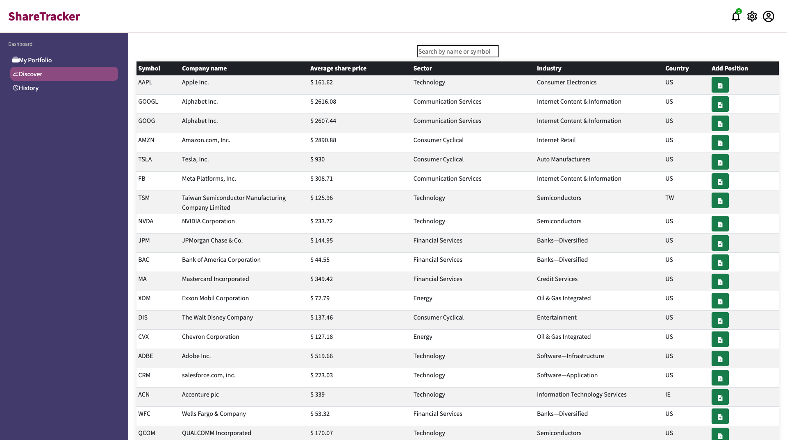

# Portfolio Tracker
The Portfolio Tracker app enables users to monitor the performance of their stock holdings and view their total portfolio value in real-time. The "Discover" page provides access to a selection of stocks sourced from an external API, featuring real-time data from the NASDAQ stock exchange. Users can compare various stocks, add them to their portfolio, and track their overall portfolio value, which is updated in real-time and displayed on the "My Portfolio" page.

Built using MongoDB, Express, React, Node.


## Screenshots


Portfolio / Home Page


Discover Page




## MVP

A user should be able to:

- Add/Remove/Update/Delete Shares.
- View total current value.
- View individual and total performance trends.
- Retrieve a list of share prices from an external API and add shares to their portfolio.
- View a chart of the current values in their portfolio.

## Extensions

- View current share price of individual shareholdings.
- View average and total paid prices for individual shares in the portfolio.
- View a chart of total paid price, total value and profit/loss.
- Implement a search box to find a specific stock using external API data.
- Temporarily add searched and selected stock to compare.
- Compare past share performance data for any publicly traded company.

## API, Libraries, Resources
- https://financialmodelingprep.com/ (Requires an account)
- https://www.highcharts.com/ HighCharts is an open-source library for rendering responsive charts.
- https://reactjs.org/
- https://expressjs.com/
- https://www.mongodb.com/
- https://nodejs.org/en/

## The project is built using:
* Javascript (Node)
* React
* Express
* MongoDB
* HTML / CSS
* Additional libraries used: HighCharts, Bootstrap
The application is using Financial Modeling Prep API as a source of stock data: https://financialmodelingprep.com/developer/docs/

## Project set up

| Front-end (client) | Back-end (server)    |
| :---               | :---                 |
| `npm install`      | `npm install`        |
| `npm start`        | `npm run seeds`      |
|                    | `npm run server:dev` |

To run this application locally, sign-up to get a free API key kere: https://financialmodelingprep.com/. Then inside ``` client/src/services ``` folder create a new file ```apikey.js```. Inside this file insert the line from bellow adding your API key where indicated:

```

export const apikey = "API_key_here"
export const apikeyPH = "API_key_here"

```
